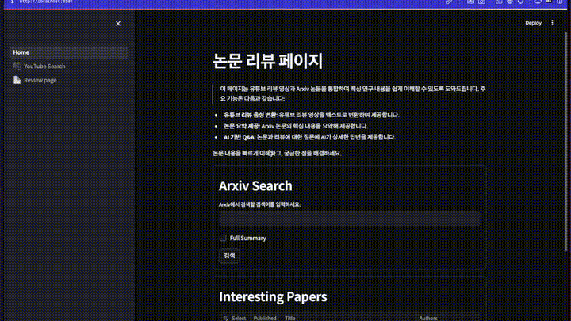

# 논문 리뷰어 체인 (Paper Reviewer Chain)

이 프로젝트는 학술 논문을 효과적으로 이해하고 분석하기 위한 AI 기반 도구입니다. Arxiv에서 논문을 검색하고, YouTube 리뷰 영상의 내용을 분석하여, 이를 바탕으로 사용자의 질문에 답변하는 기능을 제공합니다.

## 예시 영상



## 설치 및 설정

1. 이 저장소를 클론합니다:
```bash
git clone https://github.com/DShomin/paper_reviewer_chain.git
cd paper_reviewer_chain
```

2. 가상 환경을 생성하고 활성화합니다:
```bash
python -m venv .venv
# Windows에서는
.venv\Scripts\activate
# macOS/Linux에서는
source .venv/bin/activate
```

3. 필요한 패키지를 설치합니다:
```bash
pip install -r requirements.txt
```

4. `.env.example` 파일을 `.env`로 복사하고 필요한 API 키를 입력합니다:
```bash
cp .env.example .env
# 텍스트 에디터로 .env 파일을 열어 API 키를 입력합니다
```

## 필요한 .env 변수

이 프로젝트에는 다음 API 키가 필요합니다:

- `OPENAI_API_KEY`: OpenAI API 키 - GPT 모델과 임베딩 모델을 사용하기 위해 필요 [OpenAI API 키 발급](https://platform.openai.com/api-keys)
- `YOUTUBE_API_KEY`: YouTube Data API 키 - YouTube 영상 검색 및 정보 가져오기 위해 필요 [YouTube Data API 키 발급](https://console.cloud.google.com/)

## 실행 방법

애플리케이션을 실행하려면:

```bash
streamlit run Home.py
```

또는 다음과 같이 실행할 수도 있습니다:

```bash
python -m streamlit run Home.py
```

## 주요 기능과 사용 방법

### 1. 홈 페이지 (Home.py)

- **Arxiv 논문 검색**: 홈 페이지에서 관심 있는 논문 키워드를 입력하여 검색할 수 있습니다.
  - 검색 결과에서 논문의 제목, 저자, 요약을 확인할 수 있습니다.
  - '관심' 토글을 통해 논문을 관심 목록에 추가하거나 제거할 수 있습니다.
  - 'Go pdf' 버튼을 클릭하여 원본 논문 PDF를 볼 수 있습니다.

- **관심 논문 관리**: 등록한 관심 논문 목록을 확인하고 관리할 수 있습니다.
  - 'Translate abstract' 버튼을 클릭하여 초록을 다른 언어로 번역할 수 있습니다.
  - 'Search on YouTube' 버튼을 클릭하여 해당 논문과 관련된 YouTube 영상을 검색할 수 있습니다.
  - 'Go to Review Page' 버튼을 클릭하여 논문 리뷰 페이지로 이동할 수 있습니다.

### 2. YouTube 검색 페이지 (pages/🎥 YouTube Search.py)

- **논문 관련 영상 검색**: 논문 제목을 기반으로 YouTube에서 관련 리뷰 영상을 검색합니다.
  - 검색 결과에서 영상의 제목, 조회수, 좋아요 수, 댓글 수, 업로드 시간을 확인할 수 있습니다.
  - 'Watch on YouTube' 버튼을 클릭하여 원본 영상을 시청할 수 있습니다.

- **스크립트 추출**: 영상의 내용을 텍스트로 변환할 수 있습니다.
  - '유튜브 자막' 또는 'Whisper 음성 인식' 중 원하는 방식을 선택할 수 있습니다.
  - 'Whisper 음성 인식'의 경우 언어를 선택하여 해당 언어로 변환할 수 있습니다.
  - '스크립트 저장' 버튼을 클릭하여 변환된 텍스트를 저장할 수 있습니다.

### 3. 리뷰 페이지 (pages/📄 Review page.py)

- **다국어 지원**: 상단에서 원하는 응답 언어(한국어, English, 日本語, 中文)를 선택할 수 있습니다.

- **RAG(Retrieval-Augmented Generation) 생성**: 
  - 'Paper RAG 생성' 버튼을 클릭하여 논문 내용을 기반으로 한 검색 시스템을 생성합니다.
  - 'YouTube RAG 생성' 버튼을 클릭하여 YouTube 스크립트를 기반으로 한 검색 시스템을 생성합니다.
  - 두 시스템이 모두 생성되면 자동으로 앙상블하여 더 포괄적인 검색 결과를 제공합니다.

- **질문 및 답변**: 
  - 논문에 대한 질문을 입력하면 논문과 YouTube 리뷰 내용을 기반으로 답변을 생성합니다.
  - 선택한 언어로 답변이 제공됩니다.

- **리뷰 작성**: 
  - 논문에 대한 리뷰를 Markdown 형식으로 작성하고 저장할 수 있습니다.
  - 작성된 내용은 실시간으로 오른쪽 패널에 렌더링됩니다.

- **YouTube 스크립트 조회**: 
  - 저장된 YouTube 스크립트를 확인하고 활용할 수 있습니다.

## 데이터 저장소

이 애플리케이션은 다음과 같은 데이터를 로컬에 저장합니다:

- `data/paper_csv/`: 관심 논문 목록과 번역된 초록이 저장됩니다.
- `data/youtube_audio/`: YouTube 영상의 오디오와 스크립트가 저장됩니다.
- `data/vector_db/`: RAG 생성 시 만들어진 벡터 데이터베이스가 저장됩니다.
- `data/review_markdown/`: 작성한 논문 리뷰가 Markdown 형식으로 저장됩니다.

## 프로젝트 구조

```
paper_reviewer_chain/
├── Home.py                    # 메인 애플리케이션 진입점
├── pages/                     # 애플리케이션 페이지
│   ├── 📄 Review page.py      # 논문 리뷰 페이지
│   └── 🎥 YouTube Search.py   # YouTube 검색 페이지
├── src/                       # 핵심 소스 코드
│   ├── arxiv_search.py        # Arxiv 검색 기능
│   ├── translator.py          # 번역 기능
│   ├── utils.py               # 유틸리티 함수
│   ├── youtube_search.py      # YouTube 검색 기능
│   └── summarizor.py          # 요약 기능
├── data/                      # 데이터 파일 (git에서 제외됨)
│   ├── paper_csv/             # 논문 정보 CSV
│   ├── youtube_audio/         # YouTube 오디오 및 스크립트
│   ├── vector_db/             # 벡터 데이터베이스
│   └── review_markdown/       # 작성된 리뷰 마크다운
├── .env                       # 환경 변수 (git에서 제외됨)
├── .env.example               # 환경 변수 예시 파일
└── requirements.txt           # 의존성 패키지 목록
```

## 기술 스택

- **Python**: 주요 프로그래밍 언어
- **Streamlit**: 웹 인터페이스 구현
- **LangChain**: LLM 애플리케이션 개발 프레임워크
- **OpenAI API**: GPT 모델과 임베딩 모델 사용
- **Whisper API**: 음성 인식을 위한 API
- **YouTube Data API**: YouTube 영상 검색 및 정보 가져오기
- **FAISS**: 벡터 데이터베이스 및 유사성 검색

## 참고 사항

- `data/` 디렉토리와 `.env` 파일은 Git에서 제외되어 있습니다.
- Whisper 음성 인식은 OpenAI API 크레딧을 사용하므로 음성 분량에 따라 비용이 발생할 수 있습니다.
- YouTube 영상의 자막이 없는 경우 'Whisper 음성 인식'을 사용해야 할 수 있습니다.
- 논문의 벡터 데이터베이스 생성은 처음 실행 시 시간이 소요될 수 있습니다. 
